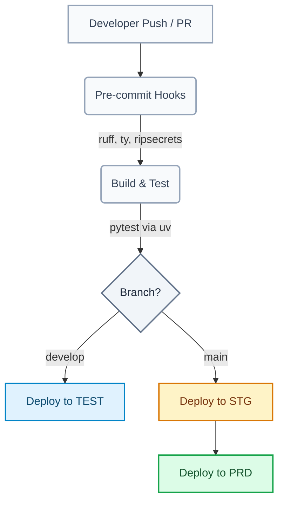
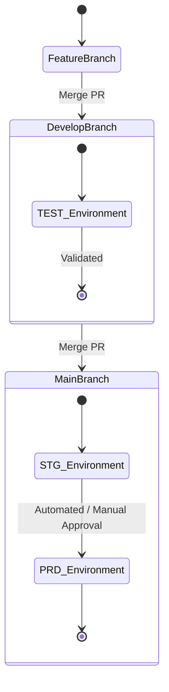

# Sample UV Pipeline & CI/CD Architecture

Welcome to the **Sample UV Pipeline**, an ultra-fast, modern Python template designed with efficiency and robust CI/CD in mind. This repository demonstrates how to integrate purely Rust-backed Python tooling alongside a multi-environment deployment pipeline via GitHub Actions.

---

## 🛠️ Technology Stack

This project leverages the fastest tools in the Python ecosystem:

- **Package Manager**: [uv](https://docs.astral.sh/uv/) - An extremely fast Python package and project manager.
- **Linting & Formatting**: [ruff](https://docs.astral.sh/ruff/) - A Rust-backed linter/formatter replacing `flake8`, `black`, `isort`, `pylint`, and `pydocstyle`.
- **Type Checking**: [ty](https://github.com/astral-sh/redknot) *(formerly Red Knot)* - Astral's upcoming blazing-fast type checker, replacing `mypy`.
- **Secret Scanning**: [ripsecrets](https://github.com/sirwart/ripsecrets) - A fast Rust alternative to `gitleaks` for preventing secrets from being committed.

---

## 🚀 CI/CD Pipeline Workflow

Our continuous integration and deployment pipeline is fully automated through GitHub Actions.

### Pipeline Overview



### Deployment Strategy

Deployments are strictly branch-dependent and mapped to specific GitHub Environments:



1. **TEST**: Triggered automatically when code is pushed or merged into the `develop` branch.
2. **STG (Staging)**: Triggered automatically when code is merged into the `main` branch.
3. **PRD (Production)**: Triggered sequentially upon the successful completion of the STG deployment (typically guarded by a manual environment approval rule in GitHub).

---

## 💻 Local Development Setup

To run this project locally, ensure you have `uv` installed, then follow these steps:

1. **Initialize Environment & Install Dependencies**
   ```bash
   uv sync --all-extras --dev
   ```

2. **Run Tests**
   ```bash
   uv run pytest
   ```

3. **Install Pre-commit Hooks**
   ```bash
   uvx pre-commit install
   ```

4. **Run Pre-commit Manually**
   ```bash
   uvx pre-commit run --all-files
   ```
